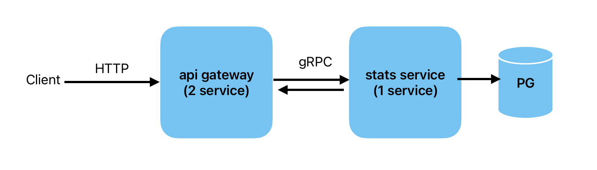

# Описание решения
Серивисные слои не стала реализовывать тк в данном случае они избыточны

#### Схема взаимодействия сервисов



---
####  Запуск всего приложения 
```docker-compose up```

---
#### Тестовые данные

Написана вставка тестовых данных в БД 
```stats-service/internal/db/migrations/002_fill_data.up.sql```

---
#### Тестовыe запросы

```cd api-gateway/cmd/http_server```

```
curl -X POST "http://localhost:8080/call?user_id=1&service_id=2"

curl -X POST "http://localhost:8080/service" \
     -H "Content-Type: application/json" \
     -d '{
           "name": "abc",
           "description": "descrpit",
           "price": 2.5
         }' 

Если хотим игнорировать фильтры (либо один из них) то пишем user_id=0 service_id=0
curl -X GET "http://localhost:8080/calls?user_id=1&service_id=0&page=1&limit=10"
```


---
#### Безопасность

В решении учла проблемы безопасности, которые мы обсуждали на собеседовании:
 - **sql инъекции**: передаем параметры в запрос через $
 - **Ddos атаки**: в GIN повесила на хэндлеры limiterMiddleware (100 rps)


---
#### Тестовыe запросы к gRPC серверу (если запустить локально)
```cd stats-service/cmd/grpc_server/```

```
grpcurl -plaintext -d '{"name":"name", "description":"descr", "price":2.5}' localhost:9090 proto.StatsService.CreateService

grpcurl -plaintext -d '{"user_id":1, "service_id":3}' localhost:9090 proto.StatsService.PostCall

grpcurl -plaintext -d '{"user_id":1, "service_id":3, "page":0, "limit":10}' localhost:9090 proto.StatsService.GetStats
```

---
#### Как можно улучшить?

- написать unit и интеграционные тесты для всех модулей с основной логикой
- добавить redis кэш в stats-service чтобы снизить нагрузку на БД