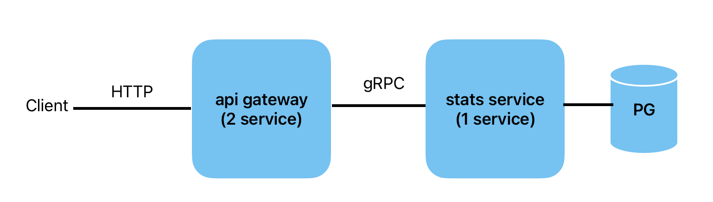

# Описание решения


#### Схема взаимодействия сервисов



---
####  Запуск всего приложения 
```docker-compose up```

---
#### Тестовые данные

Написана вставка тестовых данных в БД 
```stats-service/internal/db/migrations/002_fill_data.up.sql```

---
#### Тестовыe запросы

``` curl -X GET "http://localhost:8080/calls?user_id=123&service_id=456&page=1&limit=10" ```


---
#### Безопасность

В решении учла проблемы безопасности, которые мы обсуждали на собеседовании:
 - **sql инъекции**: $
 - **Ddos атаки**: в GIN повесила на хэндлеры limiterMiddleware (100 rps)


---
cd stats-service/cmd/grpc_server/

grpcurl -plaintext -d '{"name":"name", "description":"descr"}' localhost:9090 proto.StatsService.CreateService

grpcurl -plaintext -d '{"user_id":1, "service_id":3}' localhost:9090 proto.StatsService.PostCall

grpcurl -plaintext -d '{"user_id":1, "service_id":3, "page":0, "limit":10}' localhost:9090 proto.StatsService.GetStats